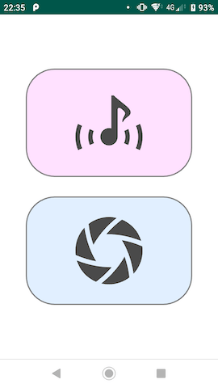

# THETA Plug-in Web UI Browser

Simple web browser that can access the web UI of THETA plug-in even on Android 9. ([日本語版はこちら](README.ja.md))

On Android 9, when the cellular network is enabled, the the browser can not connect to the web UI of the THETA plugin.

## Usage

Connect with THETA, start up the plugin, and start this application.

You can reload by swiping down the screen.

The screen below shows an example displaying the [Meow Shot!](https://pluginstore.theta360.com/plugins/be.shiro.meowshot/) Web UI.

## Known Issues

* It can not connect if THETA is in Wi-Fi client mode.

## Technical Information

I referred to this article. Thanks Kei Nakazawa-san.

[THETA用の非公式写真転送・シャッターアプリを作ってる | muo notes](https://notes.muo.jp/1810_theta-app.html)

There are only two things I do

* Call [bindProcessToNetwork](https://developer.android.com/reference/android/net/ConnectivityManager.html#bindProcessToNetwork(android.net.Network)) to bind process to Wi-Fi network.
* Allow Cleartext Traffic. See [Android Developers Blog: Protecting users with TLS by default in Android P](https://android-developers.googleblog.com/2018/04/protecting-users-with-tls-by-default-in.html).
